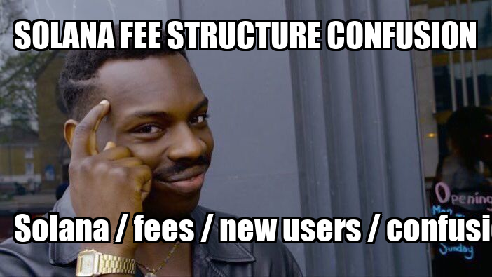

# AI Agents Portfolio — Web3 Retail Adoption Loop

An end-to-end multi-agent system that **detect Web3 pain points** from social media, **turn them into content**, and auto-generates memes + captions and **publish on social** to accelerate Web3 retail adoption.

> **Agents in the loop**
> 1) **Signal Agent** — Detects pain points & trends from social data (e.g., Reddit, X).
> 2) **Content/Social Agent** — Generates a meme + caption and (optionally) posts to X/Twitter.
> 3) **(Optional future) Tutorials/Content Agent** — Long-form explainers and guides from top pain points.

---

## Table of Contents
- Features
- Architecture
- Repo Structure
- Quickstart
- Running
- Configuration
- Outputs
- Roadmap
- License

---

## Features
- Signal → Social end-to-end pipeline with a single command runner
- Provider-flexible model routing (AIML API, OpenAI, or local LLaMA/others)
- Structured extraction & prioritization of Web3 pain points
- Meme rendering with top/bottom text + caption generation
- Optional posting to X/Twitter (disabled by default, enable in code)
- Examples & docs for easy demoing in an AI portfolio

---

## Architecture (Mermaid)

    flowchart LR
      A[Signal Agent] -->|Top issue JSON| B[Social Media Agent]
      B -->|Meme Image + Caption| C[Catbox Upload]
      C -->|URL| D[(Twitter/X Post)]
      
      subgraph Signal Agent
        A1[Scrape/Query (Reddit/X)] --> A2[Normalize & Classify]
        A2 --> A3[Prioritize Top Issues]
      end

      subgraph Social Media Agent
        B1[Generate Caption (LLM)] --> B2[Render Meme (PIL)]
        B2 --> B3[Upload]
      end

---

## Repo Structure

    ai-agents-portfolio/
    ├─ src/
    │  ├─ manager.py          # Orchestrates full loop (Signal → Social)
    │  ├─ signal_v2.py        # Signal Scout + Prioritizer (saves CSVs + handoff JSON)
    │  ├─ signal_agent.py     # Alt signal agent (provider routing)
    │  ├─ social_media.py     # Caption → meme → upload → (optional) tweet
    │  ├─ config.py           # Config/env values for clients
    │  ├─ state.py            # Simple state read/write helpers
    │  ├─ prompts.py          # Prompt strings
    │  ├─ reporting.py        # Markdown/CSV reporting helpers
    │  └─ pipeline.py         # Experimental sentiment scout pipeline (refactor target)
    ├─ assets/                # meme templates + fonts (you add these)
    ├─ examples/
    │  └─ social_media_input.json
    ├─ scripts/
    │  └─ run_pipeline.sh     # One-command runner
    ├─ docs/
    │  ├─ architecture.md
    │  └─ sample_meme.png     # <— the image shown above
    ├─ data/                  # outputs/artifacts (gitignored)
    ├─ .env.example
    ├─ requirements.txt
    ├─ .gitignore
    ├─ LICENSE
    └─ README.md

---

## Quickstart

1) Install dependencies

    python3 -m venv .venv && source .venv/bin/activate
    pip install -r requirements.txt

2) Configure environment

    cp .env.example .env
    # then open .env and fill in keys as needed

3) Add assets (optional but recommended)

    thinking.jpg, drake_hotline.jpg, wojak_crying.webp, disaster_girl.jpg, galaxy_brain.jpg
    (optional) Impact.ttf

---

## Running

Full pipeline (Signal → Social)

    bash scripts/run_pipeline.sh

This runs `src/manager.py`, which calls the Signal agent, writes handoff JSON, then calls the Social agent.

Social Agent only (using the included example)

    cp examples/social_media_input.json social_media_input.json
    python src/social_media.py

---

## Configuration

Set these in `.env` (see `.env.example`):
- `AIML_API_KEY`, `OPENAI_API_KEY` — provider credentials
- `PROVIDER` — `aimlapi`, `openai`, or other supported backends
- (Optional) Twitter/X: `TWITTER_API_KEY`, `TWITTER_API_SECRET`, `TWITTER_ACCESS_TOKEN`, `TWITTER_ACCESS_SECRET`
- (Optional) `BASE_URL`, `MODEL_NAME`, `MODEL_MAX_TOKENS`

> Posting to X/Twitter is commented out by default inside `src/social_media.py`. Enable at your own discretion.

---

## Outputs

- Signal Agent: `signal_structured_*.csv`, `signal_ranked_*.csv`, and a `social_media_input.json` handoff
- Social Agent: `meme_YYYYMMDD.png` (saved locally) and an uploaded URL (e.g., Catbox) printed to terminal
- Sample Output: see `docs/sample_meme.png` (generated by this project)

---

## Roadmap
- Expand data sources beyond Reddit/X (Discord, Telegram, GitHub Issues)
- Add content agent for long-form explainers (guides, tutorials, walkthroughs)
- Moderation, deduplication, and retry logic for robust posting
- CI tests and smoke test workflows

---

## License
MIT — see `LICENSE` for details.
